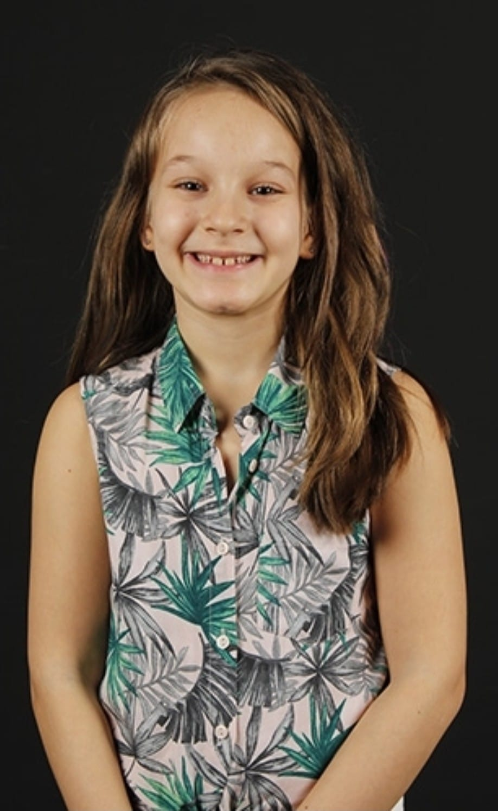

# User Personas

## User Persona-1

### 1-Bio

- _Leyla is 45 years old manager of xyz company who wants to create a new
  website_

### 1-Needs/goals

- _The first goal is to make a beautiful and handy website_
- _Second goal Submit financial support to successful universities students with
  the competition organized_

### 1-Frustrations

- _She doesn't have much knowledge to design a useful website within the
  criteria the company is looking for_.

### 1-Scenario 1

- _She organizes an activity on Friday afternoons every week, as she needs to
  promote the project for the website of the universities_

## User Persona-2

### 2-Bio

- _Farah is 13 years old and she wants to have an online diary_

### 2-Needs/Goals

- _She thinks that a nice and simple website will meet her demands_

### 2-Frustrations

- _Farah loves to write, but she doesn't know who to contact for this kind of
  website_

### 2-Scenario 1

- _Farah realized that she was reading her family's diary at home. She can't do
  her hobby of writing for a long time, but she learned from her cousin that a
  company had university students set up a website for a fee and she wants to
  join that seminars_.
